Distributed databases are essential for building scalable, resilient applications. This deep dive explores consistency models, partitioning strategies, and practical implementation patterns for modern distributed systems.

## CAP Theorem Analysis

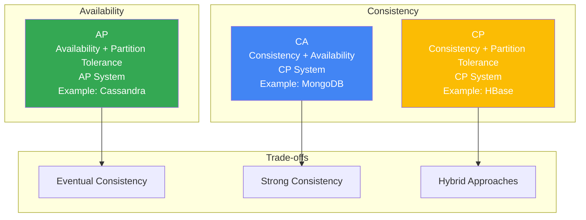

## Consistency Models Comparison

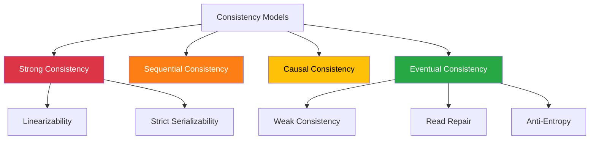

## Data Partitioning Strategies

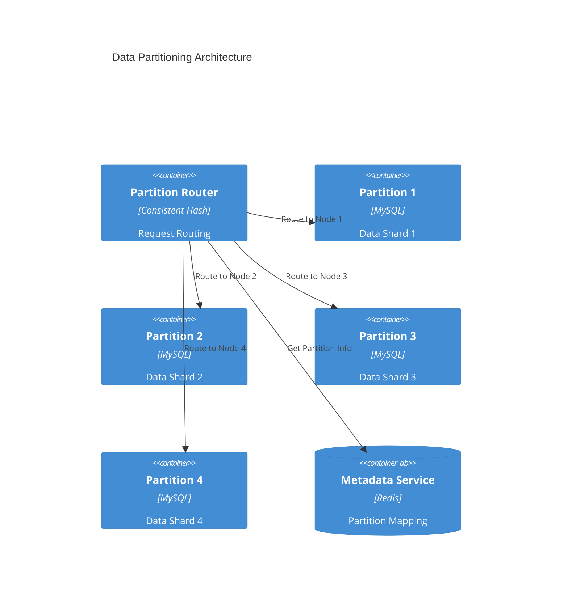

## Replication Patterns

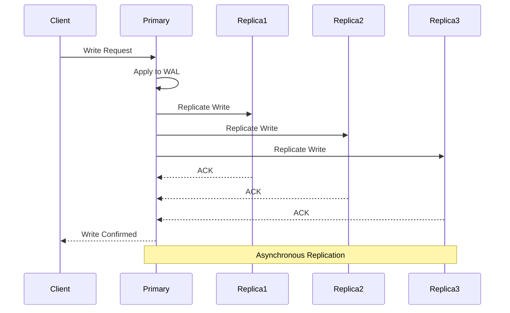

## Performance vs Consistency Trade-off

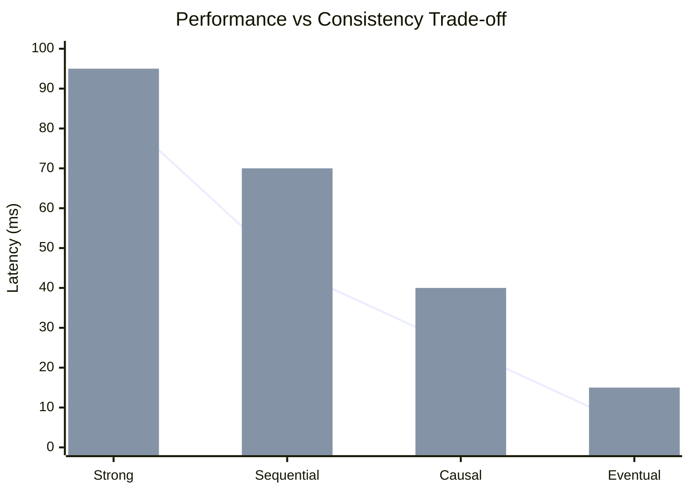

## Sharding Implementation

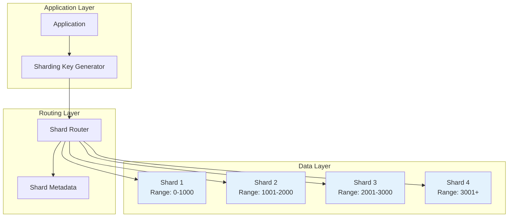

## Distributed Transaction Flow

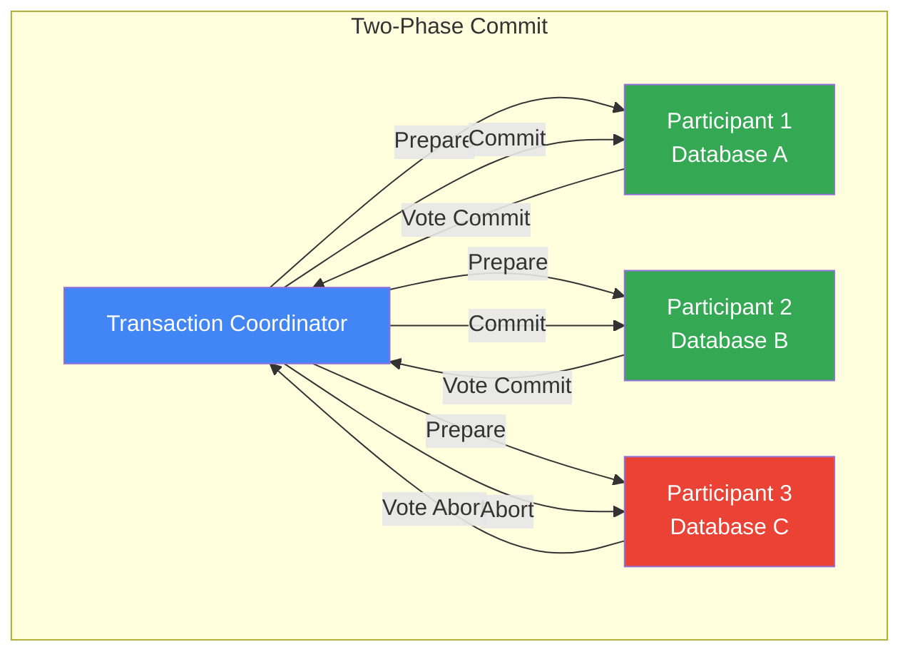

## Database Technology Landscape

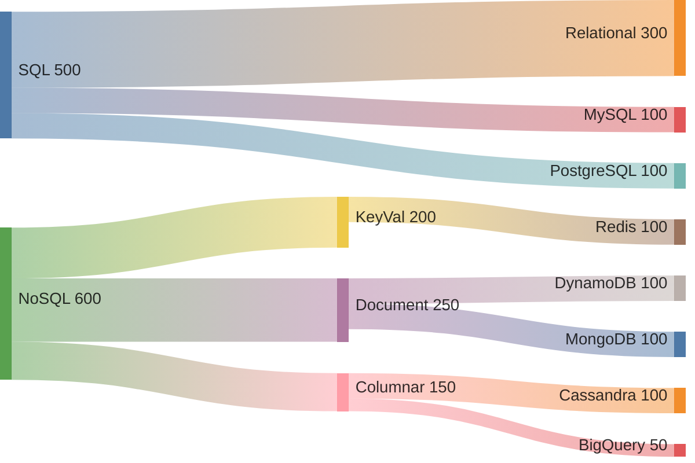

## Consistent Hashing Algorithm

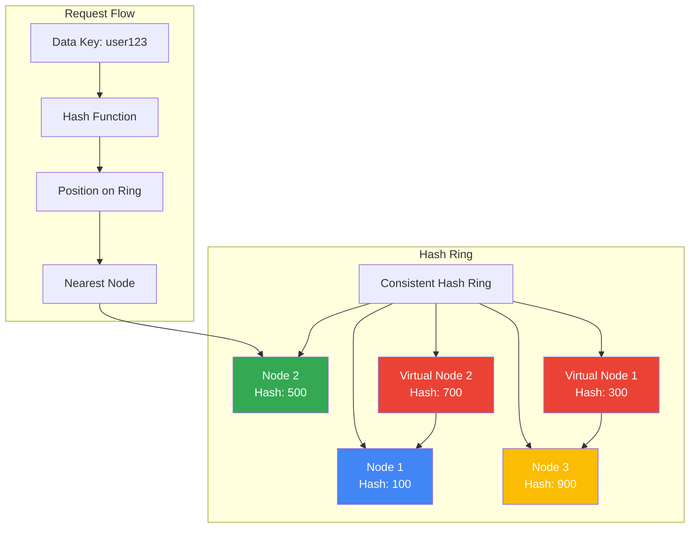

## Distributed Query Processing

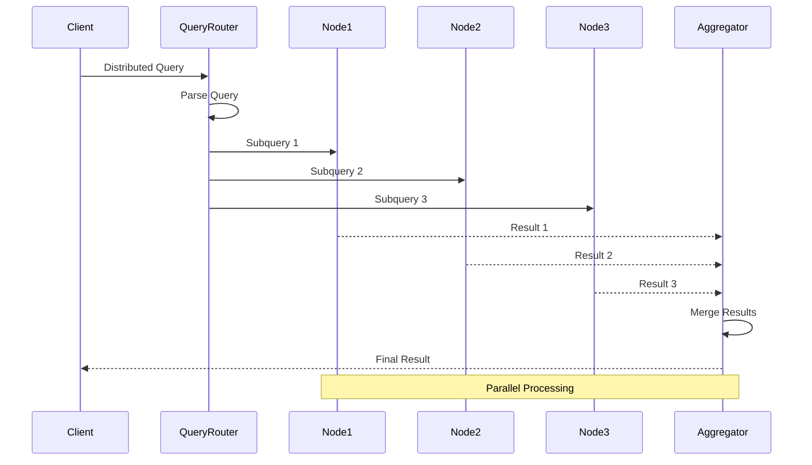

## Fault Tolerance Patterns

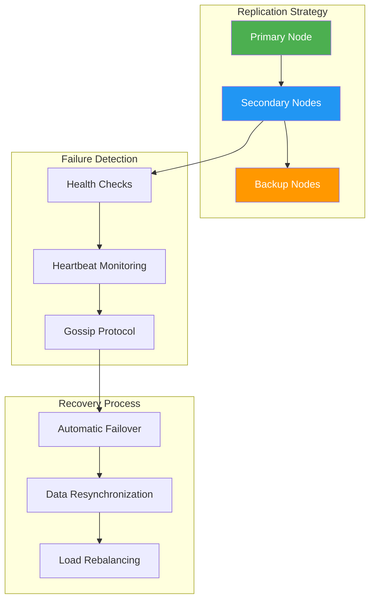

## Implementation Decision Matrix

| **Pattern** | **Use Case** | **Pros** | **Cons** | **Complexity** |
|--------------|----------------|------------|------------|-----------------|
| **Master-Slave** | Read-heavy workloads | Simple, consistent reads | Single point failure | Low |
| **Multi-Master** | High write availability | Write scaling | Conflict resolution | Medium |
| **Quorum** | Critical data | Strong consistency | Higher latency | High |
| **Eventual** | Social feeds, analytics | High availability | Stale reads | Medium |
| **Sharding** | Large datasets | Linear scaling | Complex ops | High |

## Performance Benchmarks

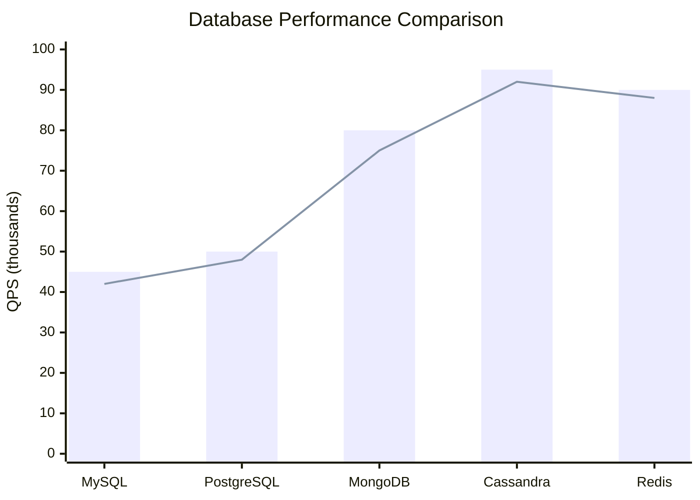

---

> *Choosing the right distributed database pattern is about understanding your consistency, availability, and performance requirements—there's no one-size-fits-all solution.*
