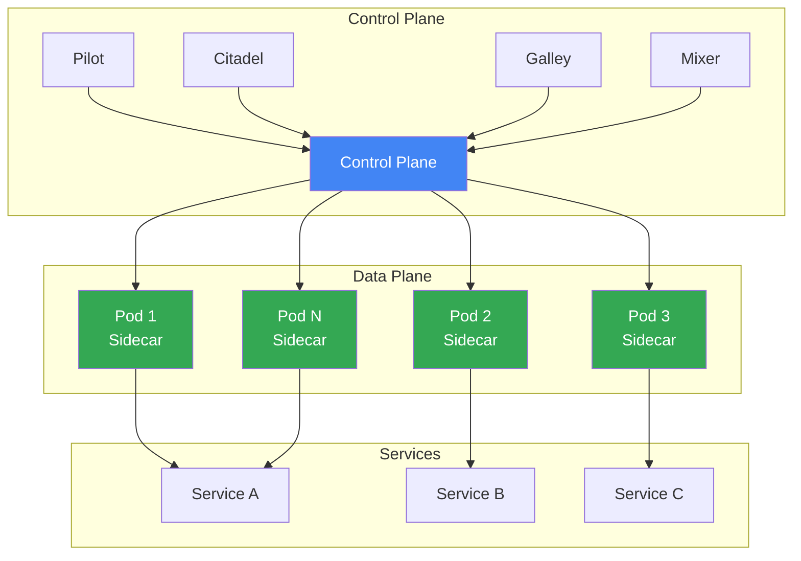
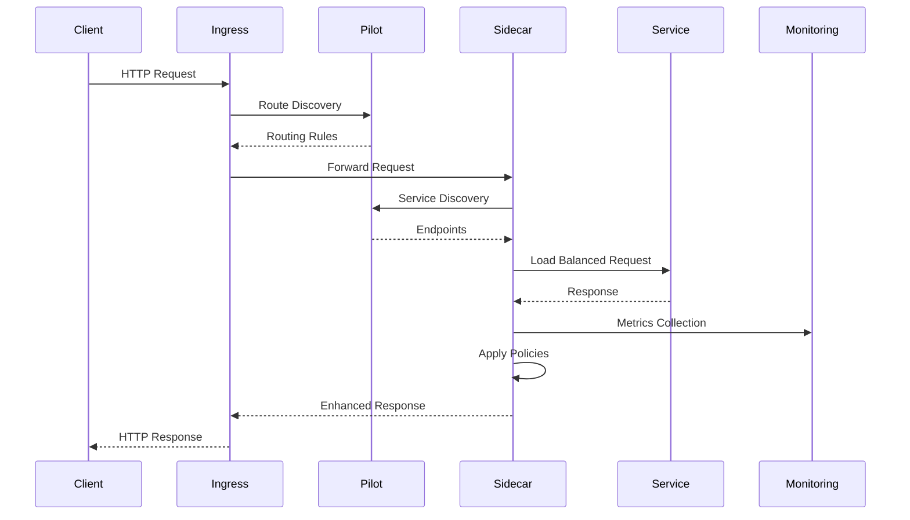
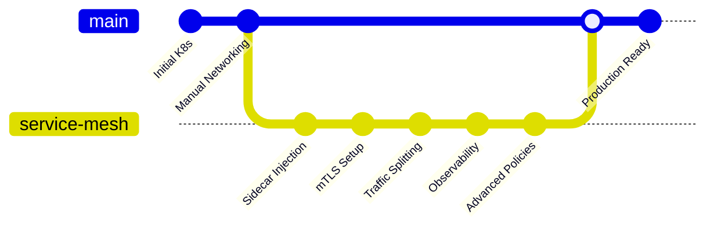
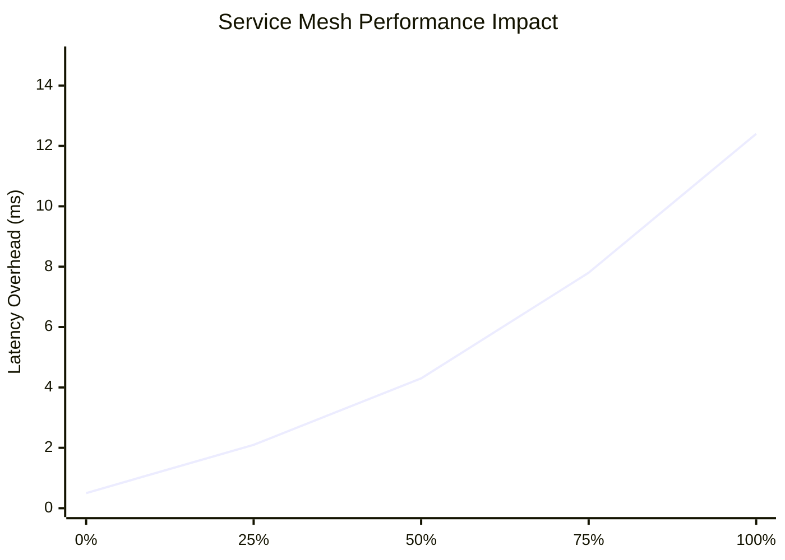
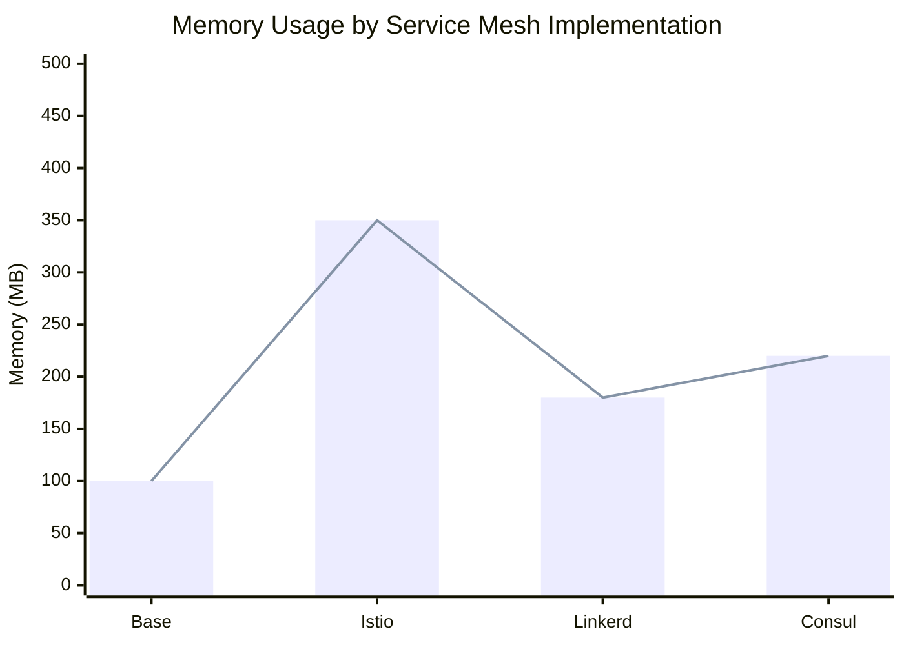
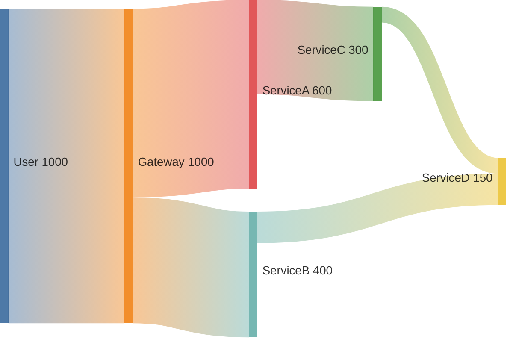
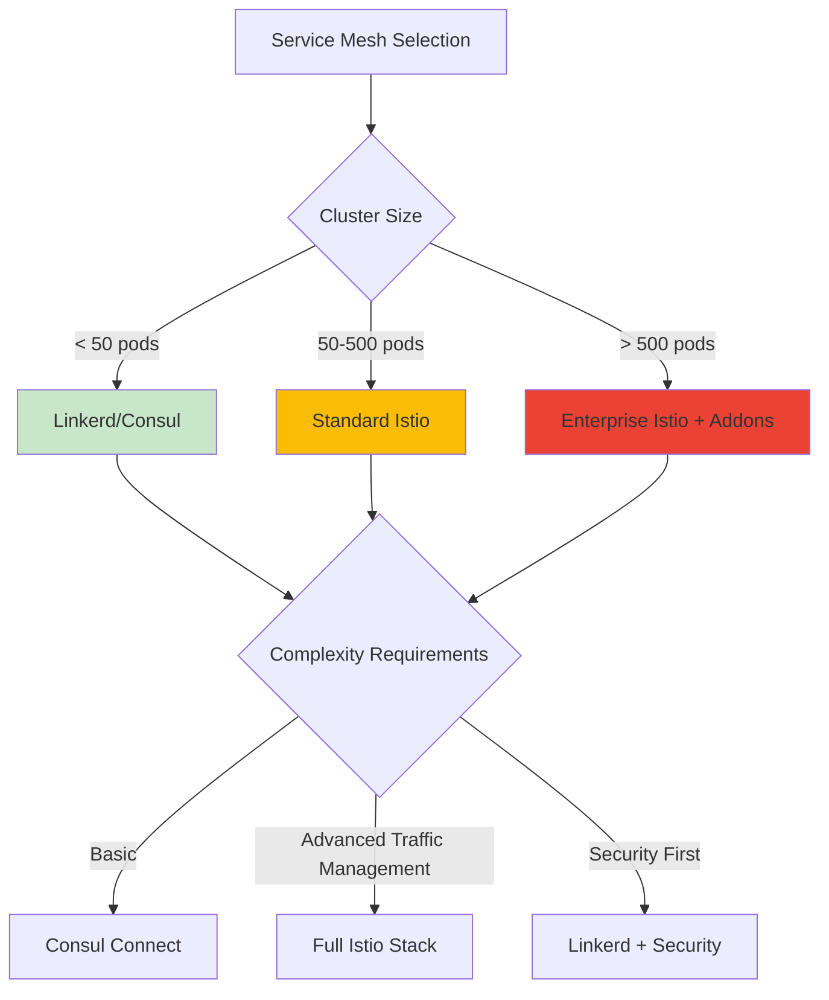
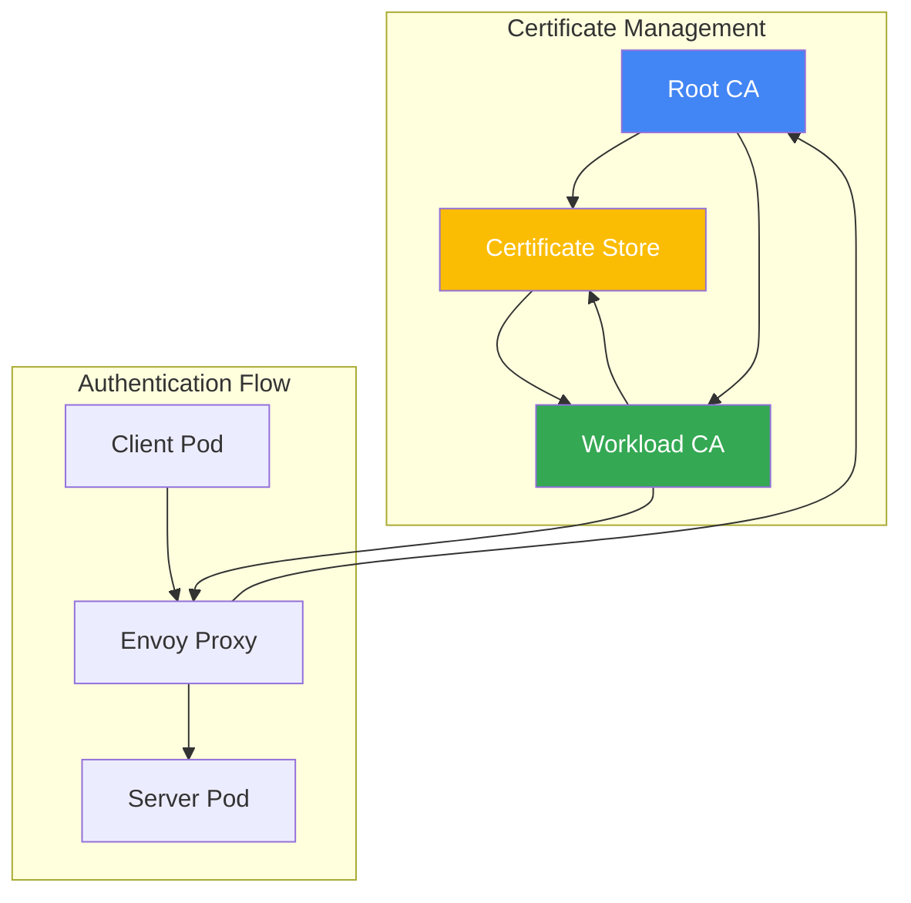
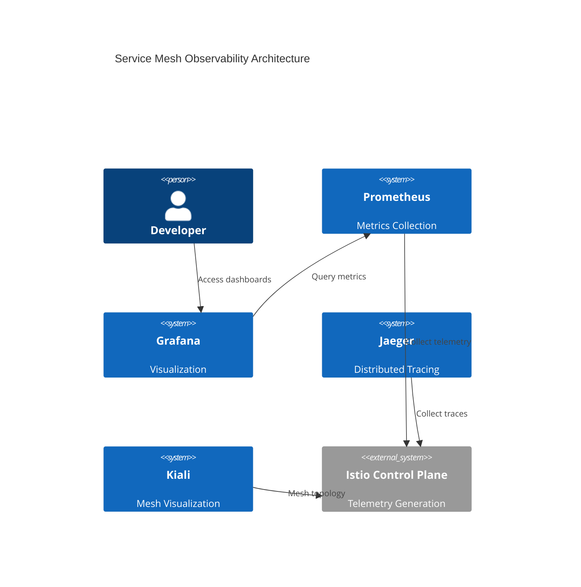

Service Mesh has emerged as essential infrastructure for managing microservices communication at scale. This comprehensive guide explores architecture patterns, implementation strategies, and practical deployment considerations.

## Service Mesh Core Architecture

## Traffic Management Flow

## Service Mesh Evolution Timeline

## Performance Impact Analysis

## Resource Utilization Comparison

## Traffic Distribution Patterns

## Implementation Decision Matrix

## Security Implementation Flow

## Observability Stack Integration

## Cost-Benefit Analysis

| **Metric** | **Without Mesh** | **With Service Mesh** | **Impact** |
|------------|------------------|---------------------|------------|
| **Deployment Complexity** | Simple | Complex | +300% |
| **Observability** | Limited | Comprehensive | +500% |
| **Security** | Manual | Automated mTLS | +200% |
| **Performance** | Optimal | +10-15% latency | -10% |
| **Reliability** | Manual | Automatic retries | +300% |
| **Operational Overhead** | Low | Medium-High | +250% |

## Best Practices Implementation

```mermaid
flowchart LR
    subgraph "Phase 1: Foundation"
        A[Infrastructure Setup]
        B[Basic Traffic Management]
        C[Core Telemetry]
    end
    
    subgraph "Phase 2: Security"
        D[mTLS Implementation]
        E[Authorization Policies]
        F[Audit Logging]
    end
    
    subgraph "Phase 3: Advanced"
        G[Advanced Traffic Splitting]
        H[Canary Deployments]
        I[Chaos Engineering]
    end
    
    A --> B --> C
    C --> D --> E --> F
    F --> G --> H --> I
    
    style A fill:#e8f5e8
    style B fill:#e8f5e8
    style C fill:#e8f5e8
    style D fill:#fff3cd
    style E fill:#fff3cd
    style F fill:#fff3cd
    style G fill:#f8d7da
    style H fill:#f8d7da
    style I fill:#f8d7da
```

---

> *Service Mesh isn't just infrastructure—it's the nervous system of modern microservices, enabling intelligent communication and deep observability.*
