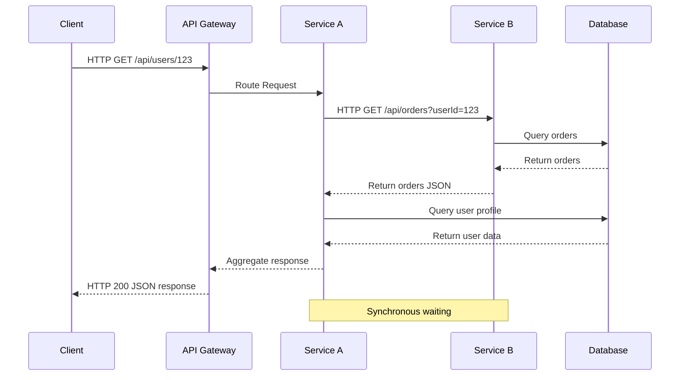
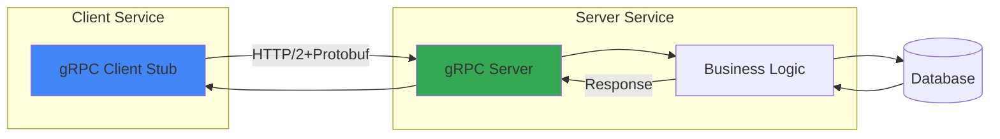
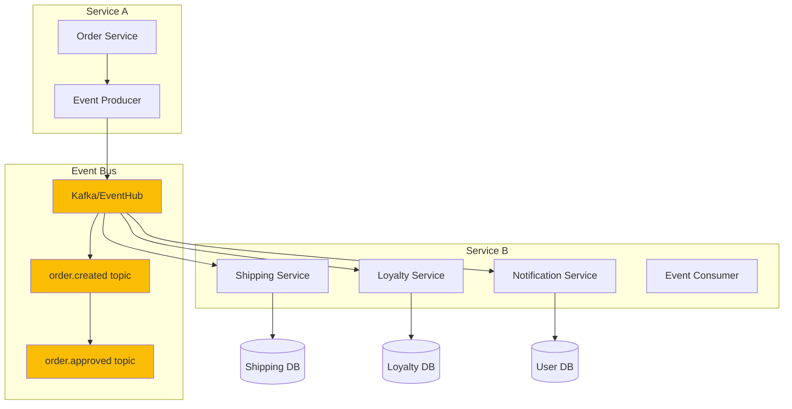
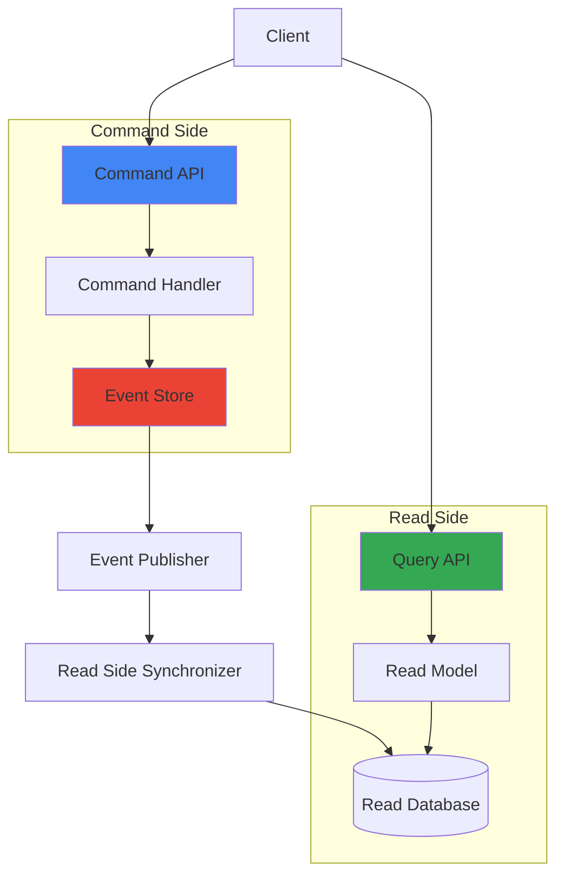
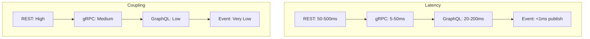
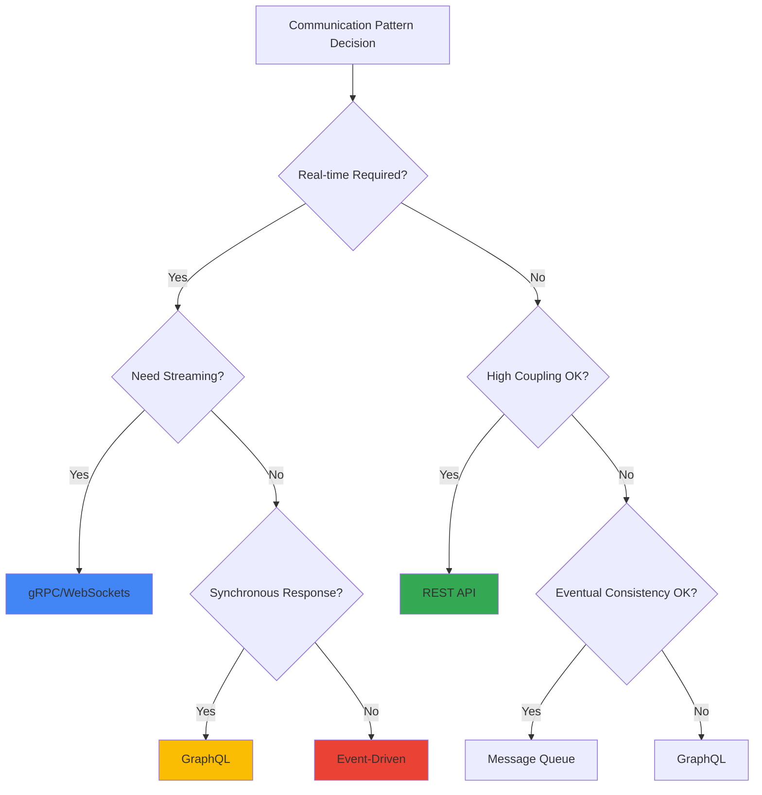

Microservices architecture has become the de facto standard for building scalable applications. However, choosing the right communication pattern between services is critical for performance, maintainability, and scalability.

## Synchronous Communication Patterns

### REST API Pattern

**Pros**: Simple, stateless, cacheable  
**Cons**: Tight coupling, cascading failures, latency

### gRPC Pattern

**Pros**: High performance, type safety, streaming support  
**Cons**: Steeper learning curve, less browser support

## Asynchronous Communication Patterns

### Event-Driven Architecture

**Pros**: Loose coupling, scalability, resilience  
**Cons**: Eventual consistency, debugging complexity

### CQRS + Event Sourcing Pattern

## Comparison Matrix

### Decision Tree

## Key Takeaways

| Pattern | Best For | Avoid When |
|---------|----------|------------|
| **REST API** | CRUD operations, simple integrations | High-frequency calls, strict latency |
| **gRPC** | Internal microservices, high throughput | Browser-facing APIs, simple use cases |
| **GraphQL** | Complex data requirements, mobile apps | Simple APIs, caching needed |
| **Event-Driven** | Distributed systems, eventual consistency | Real-time synchronous needs |
| **CQRS** | Complex domains, audit trails | Simple CRUD, consistency critical |

---

> *The best architecture isn't the most sophisticated—it's the one that solves your specific problems while staying maintainable.*