Machine Learning Operations (MLOps) bridges the gap between ML development and production operations. This comprehensive guide covers building robust, scalable ML pipelines with automated monitoring and continuous improvement.

## MLOps Architecture Overview

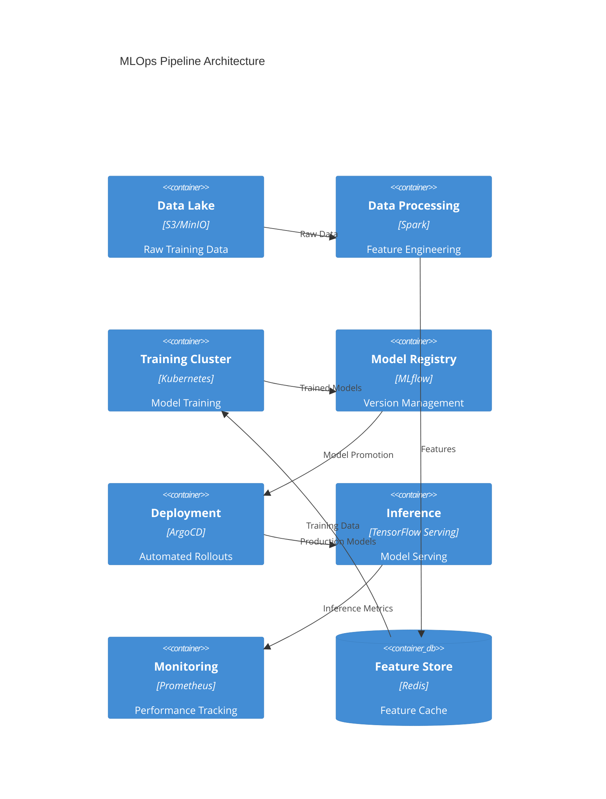

## Model Training Workflow

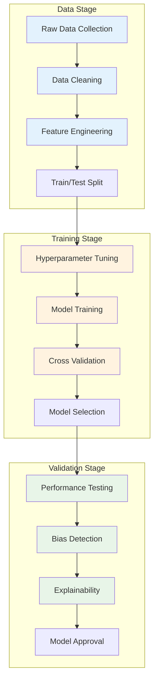

## CI/CD Pipeline Flow

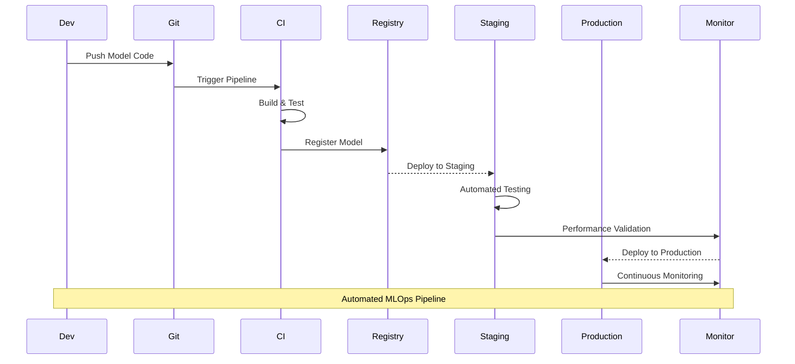

## Model Performance Evolution

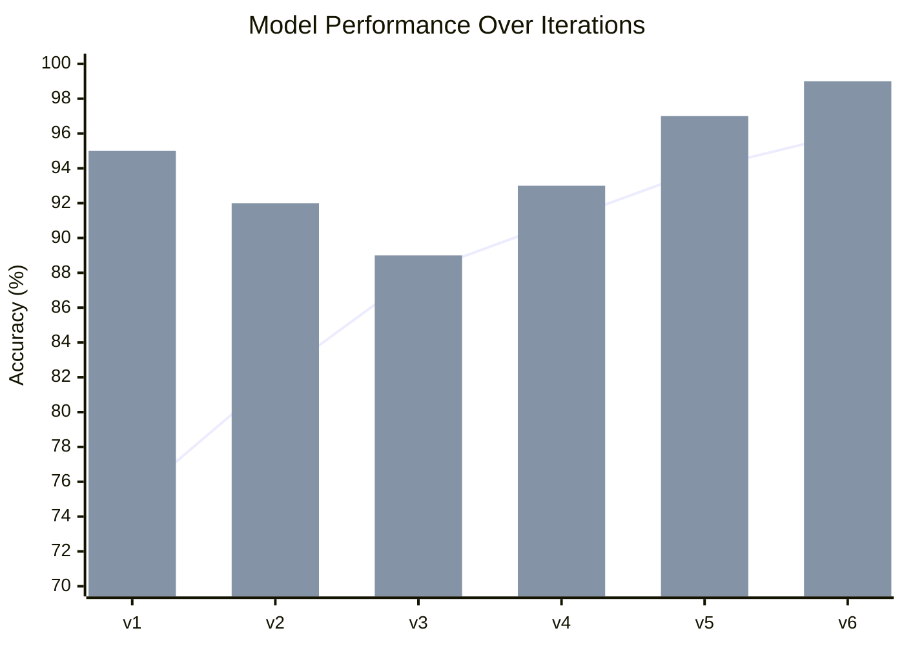

## Data Flow Analysis

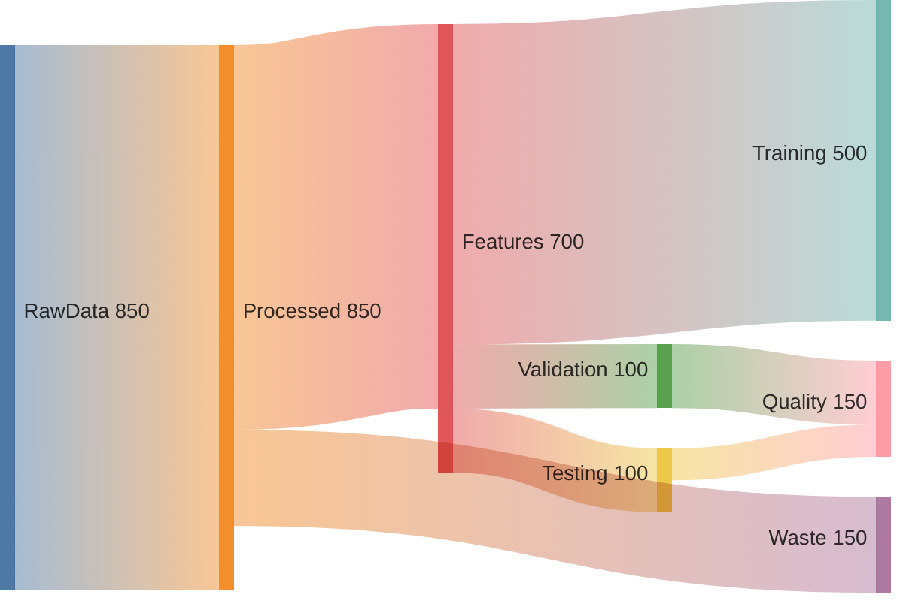

## Drift Detection Architecture

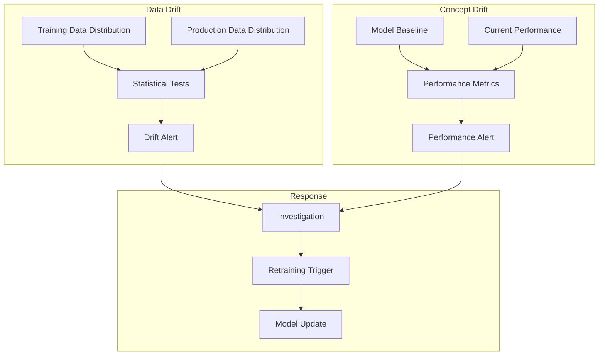

## Cost Optimization Analysis

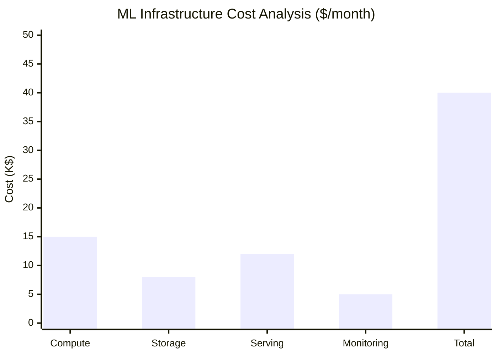

## Experimentation Framework

```mermaid
flowchart LR
    subgraph "Experiment Design"
        Hypothesis[Hypothesis]
        Metrics[Success Metrics]
        Split[Traffic Split]
    end
    
    subgraph "A/B Testing"
        Control[Control Group]
        Variant[Treatment Group]
        Collect[Data Collection]
    end
    
    subgraph "Analysis"
        Stats[Statistical Analysis]
        Confidence[Confidence Intervals]
        Decision[Statistical Significance]
    end
    
    subgraph "Implementation"
        Rollout[Progressive Rollout]
        Monitor[Real-time Monitoring]
        Rollback[Fallback Mechanism]
    end
    
    Hypothesis --> Metrics
    Metrics --> Split
    Split --> Control
    Split --> Variant
    Control --> Collect
    Variant --> Collect
    Collect --> Stats
    Stats --> Confidence
    Confidence --> Decision
    Decision --> Rollout
    Rollout --> Monitor
    Monitor --> Rollback
    
    style Control fill:#4caf50
    style Variant fill:#2196f3
    style Rollout fill:#ff9800
```

## Model Registry Workflow

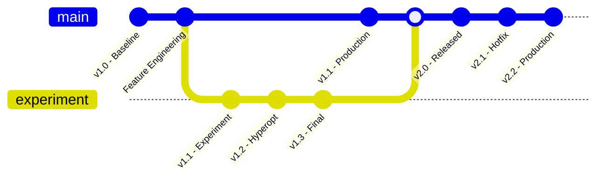

## Monitoring Dashboard Integration

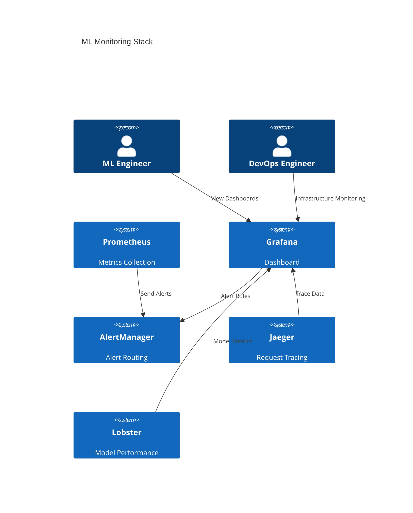

## Performance Benchmarking

| **Model Type** | **Latency (ms)** | **Throughput (req/s)** | **Accuracy** | **GPU Cost ($/hour)** |
|----------------|-------------------|------------------------|--------------|---------------------|
| **Image Classification** | 15 | 1000 | 94.5% | $2.50 |
| **NLP - Classification** | 45 | 300 | 91.2% | $3.80 |
| **Time Series Forecasting** | 8 | 2000 | 87.8% | $1.20 |
| **Recommendation** | 120 | 80 | 93.1% | $5.50 |
| **Object Detection** | 85 | 150 | 89.7% | $6.20 |

## Automated Retraining Trigger

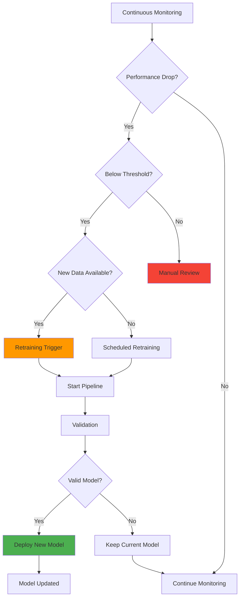

---

> *MLOps isn't just about automation—it's about creating a disciplined, repeatable process that brings models from experimentation to production with confidence and reliability.*