Zero Trust Security represents a paradigm shift from perimeter-based defense to identity-centric security. This comprehensive guide covers implementation strategies, threat modeling, and practical deployment patterns.

## Zero Trust Architecture Overview

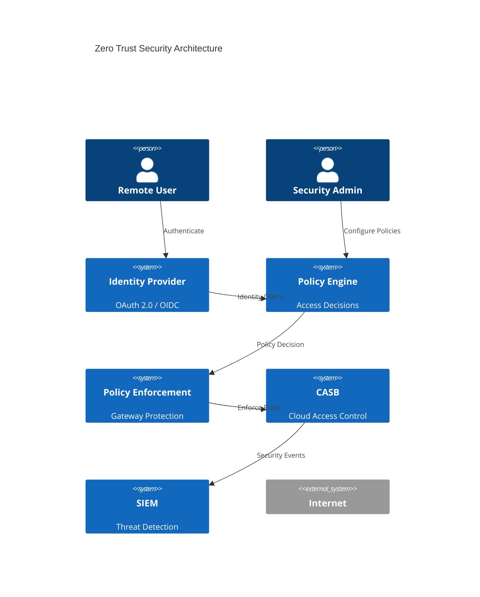

## Authentication Flow with JWT

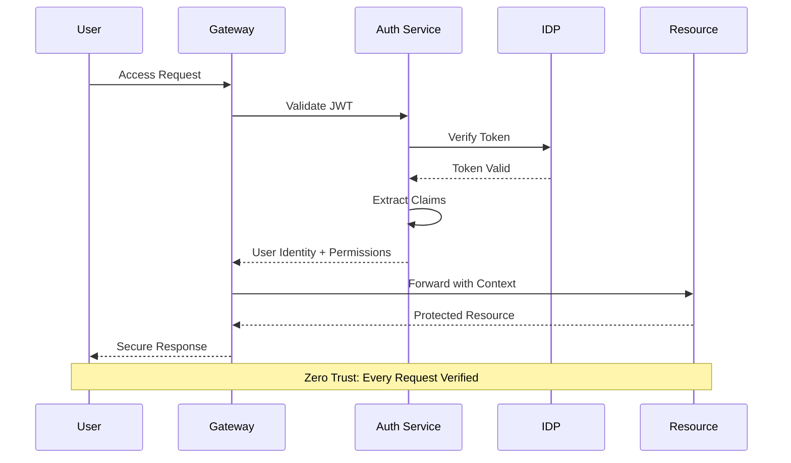

## Network Segmentation Implementation

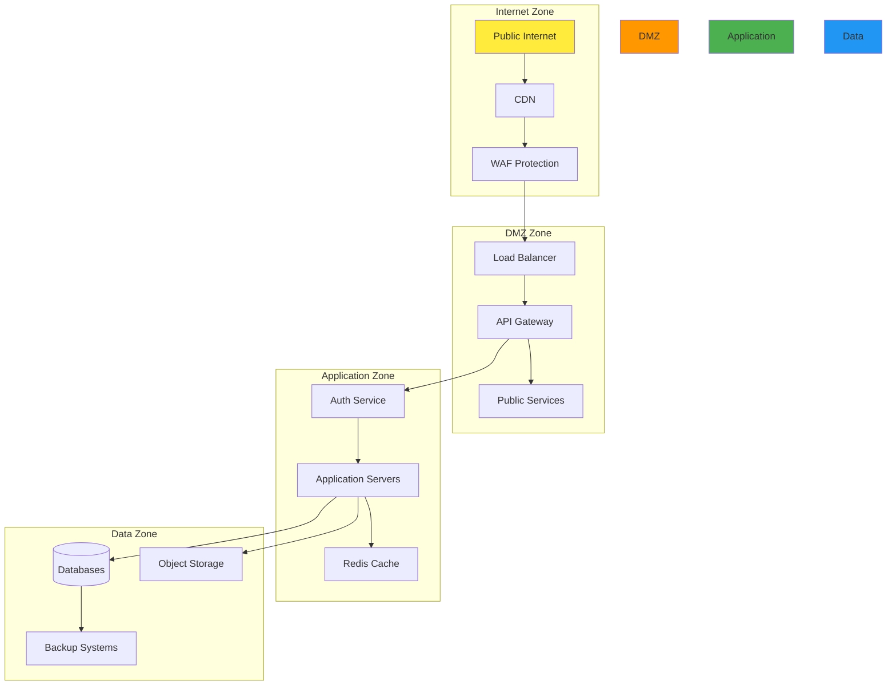

## Threat Model Analysis

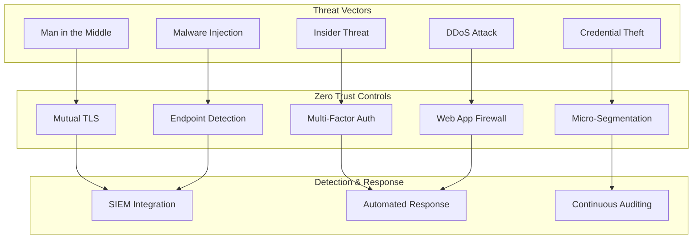

## Implementation Timeline

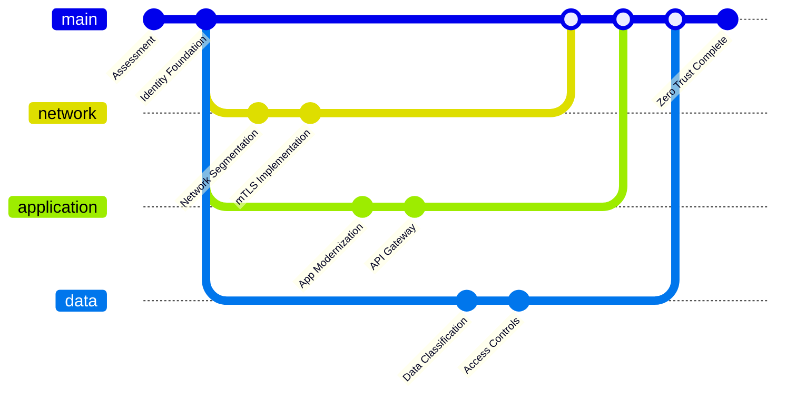

## Risk Reduction Analysis

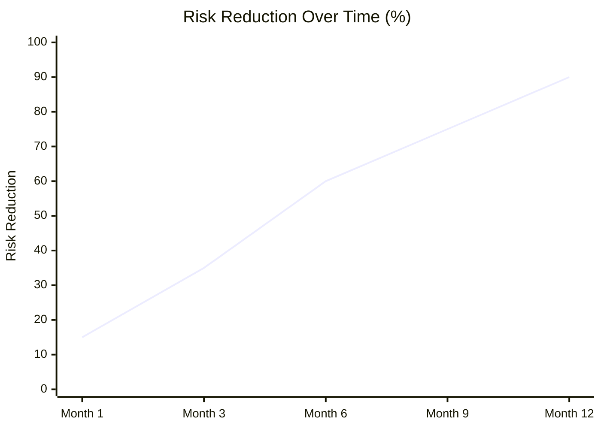

## Cost vs Security Matrix

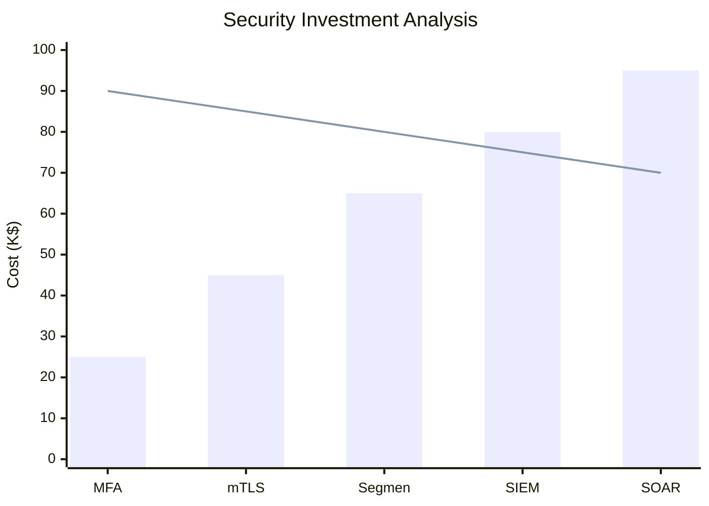

## Resource Flow Analysis

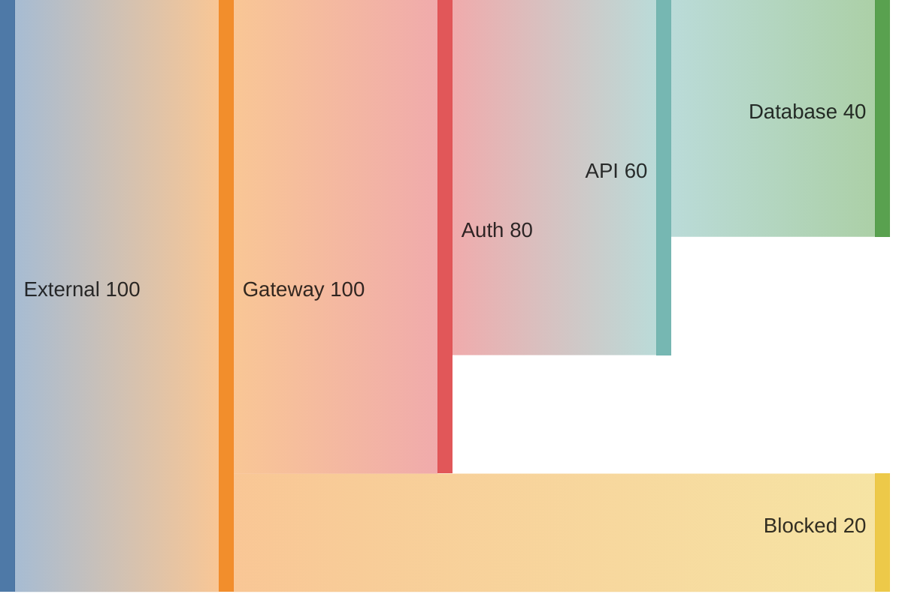

## Policy Decision Tree

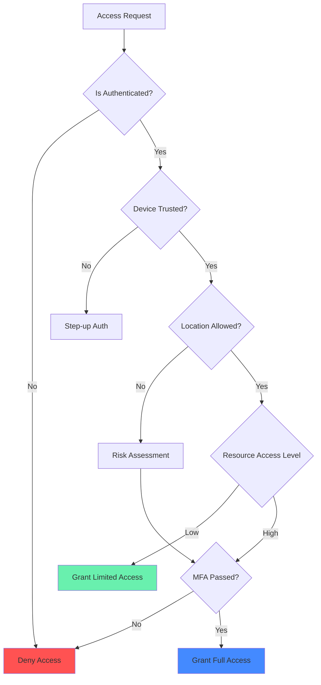

## Compliance Framework Integration

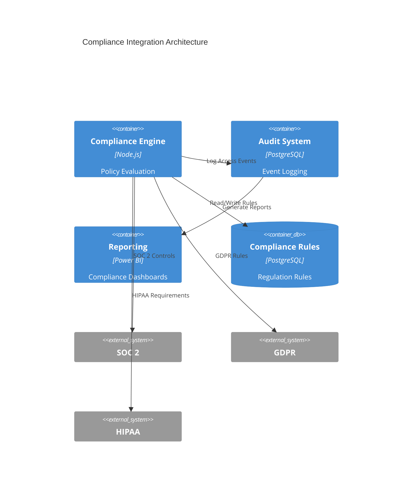

## Implementation Metrics Tracking

| **Phase** | **Metrics** | **Target** | **Current** | **Status** |
|------------|-------------|-------------|-------------|------------|
| **Foundation** | Identity Provider Integration | 100% | 85% | 🟡 |
| **Network** | Segmentation Coverage | 80% | 60% | 🟡 |
| **Application** | API Protection | 100% | 75% | 🟡 |
| **Data** | Access Controls | 90% | 45% | 🔴 |
| **Monitoring** | Threat Detection | 95% | 70% | 🟡 |

## Continuous Validation Workflow

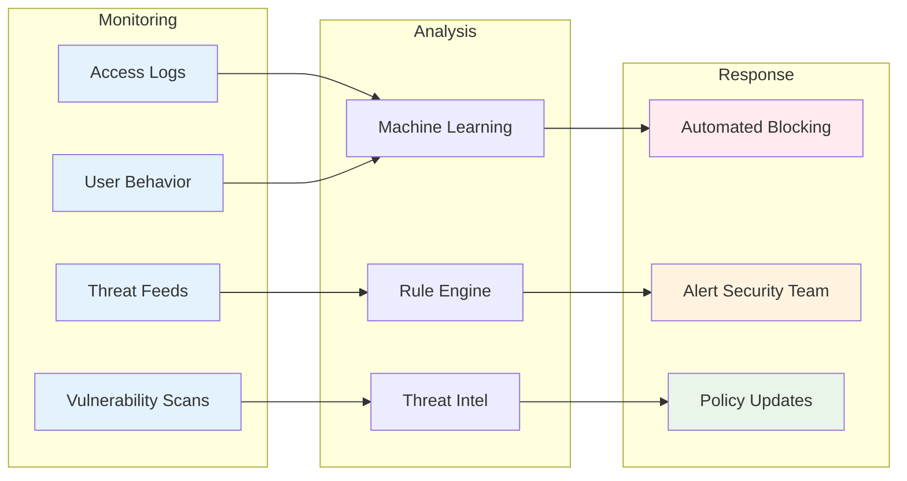

---

> *Zero Trust is not just technology—it's a security philosophy: "Never Trust, Always Verify, and Always Assume Breach."*