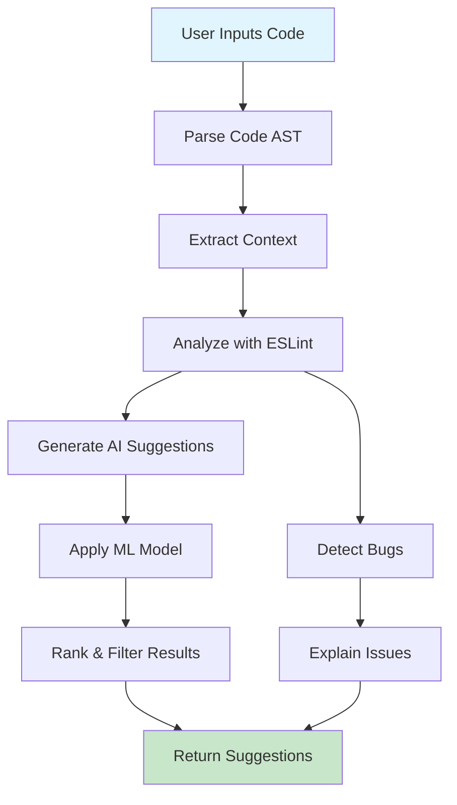
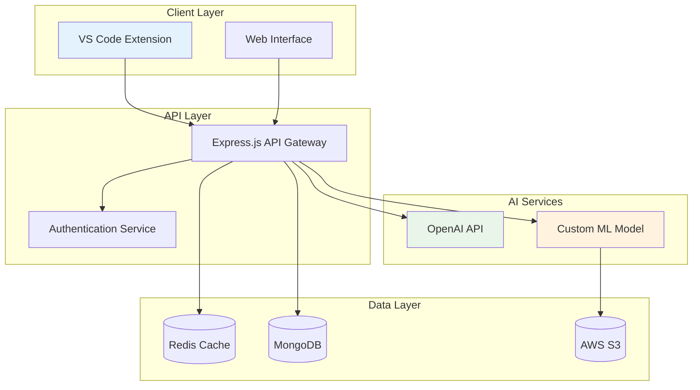
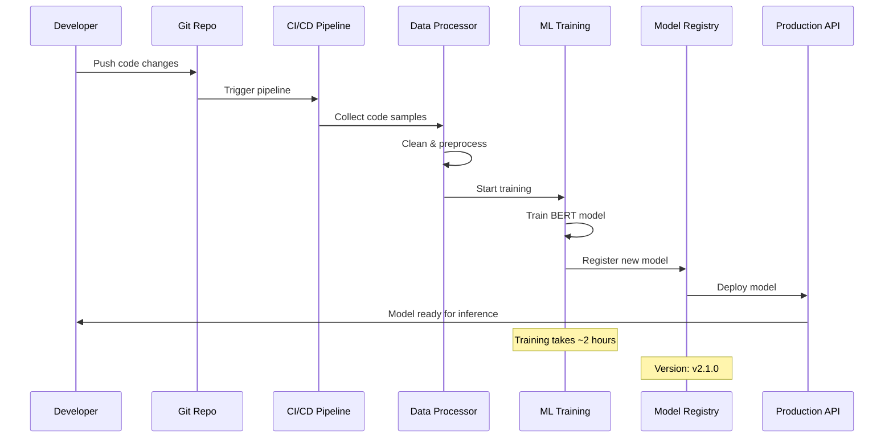
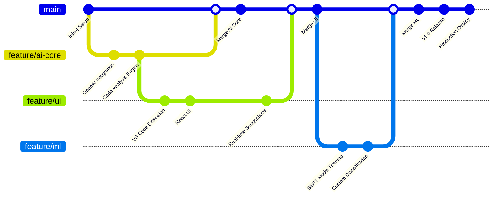
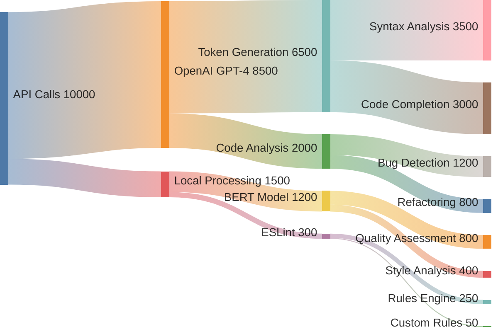

## Intelligent Code Generation & Analysis

Developed an advanced code assistant that leverages GPT-4 and custom machine learning models to provide intelligent code suggestions, bug detection, and automated refactoring recommendations.

## Code Analysis Workflow



## System Architecture



## Core Features

### Smart Code Completion

The assistant provides context-aware code completion with deep understanding of:

```typescript
interface CodeSuggestion {
  code: string;
  confidence: number;
  explanation: string;
  alternatives: string[];
}

class AISuggestionEngine {
  async generateCompletion(
    currentCode: string,
    cursorPosition: Position,
    language: string
  ): Promise<CodeSuggestion> {
    // Analyze code context using AST parsing
    const ast = this.parseCode(currentCode, language);
    const context = this.extractContext(ast, cursorPosition);

    // Generate suggestions using GPT-4
    const suggestions = await this.openai.complete({
      prompt: this.buildPrompt(context, language),
      temperature: 0.3,
      maxTokens: 200
    });

    return this.rankAndFilter(suggestions);
  }
}
```

### Real-time Bug Detection

Integrated ESLint and custom linting rules with AI-powered explanations:

```typescript
class BugDetector {
  async analyzeCode(code: string): Promise<BugReport[]> {
    const eslintResults = await this.runEslint(code);
    const aiAnalysis = await this.analyzeWithAI(code);

    return this.mergeResults(eslintResults, aiAnalysis);
  }
}
```

## Training Pipeline



## Machine Learning Integration

### Custom Code Quality Model

Trained a BERT-based model for code quality assessment:

```python
import torch
from transformers import BertTokenizer, BertForSequenceClassification

class CodeQualityClassifier:
    def __init__(self):
        self.tokenizer = BertTokenizer.from_pretrained('bert-base-uncased')
        self.model = BertForSequenceClassification.from_pretrained(
            './models/code-quality-bert'
        )

    def predict_quality(self, code_snippet: str) -> float:
        inputs = self.tokenizer(
            code_snippet,
            return_tensors="pt",
            truncation=True,
            padding=True,
            max_length=512
        )

        with torch.no_grad():
            outputs = self.model(**inputs)
            probabilities = torch.softmax(outputs.logits, dim=1)

        return probabilities[0][1].item()  # Quality score
```

## VS Code Extension

Developed a comprehensive VS Code extension with:

```json
{
  "name": "ai-code-assistant",
  "displayName": "AI Code Assistant",
  "version": "1.0.0",
  "engines": {
    "vscode": "^1.70.0"
  },
  "activationEvents": [
    "onLanguage:typescript",
    "onLanguage:javascript",
    "onLanguage:python"
  ],
  "main": "./out/extension.js",
  "contributes": {
    "commands": [
      {
        "command": "aiCodeAssistant.analyzeFile",
        "title": "Analyze File with AI"
      }
    ]
  }
}
```

## Development Timeline



## Cost Distribution


