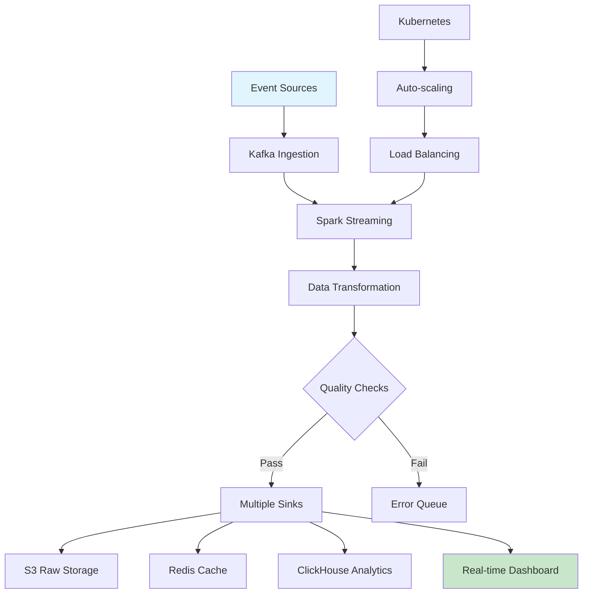

## High-Throughput Data Processing System

Built a robust data pipeline that processes billions of events daily, combining Apache Spark, Kubernetes orchestration, and real-time analytics for enterprise-scale data processing.

## Data Pipeline Architecture



## Event Ingestion Layer

```python
from kafka import KafkaConsumer
from pyspark.sql import SparkSession
import json

class EventIngestionService:
    def __init__(self, kafka_brokers, spark_master):
        self.consumer = KafkaConsumer(
            'user-events',
            bootstrap_servers=kafka_brokers,
            group_id='data-pipeline',
            auto_offset_reset='latest'
        )
        self.spark = SparkSession.builder \
            .appName("DataPipeline") \
            .master(spark_master) \
            .config("spark.sql.adaptive.enabled", "true") \
            .getOrCreate()

    def process_events(self):
        for message in self.consumer:
            event = json.loads(message.value.decode('utf-8'))
            self.process_single_event(event)

    def process_single_event(self, event):
        # Real-time event processing
        df = self.spark.createDataFrame([event])
        df = self.enrich_event(df)
        df = self.validate_event(df)

        # Write to multiple sinks
        self.write_to_s3(df, "raw-events")
        self.write_to_redis(df, "recent-events")
        self.send_to_streaming_analytics(df)
```

## Data Transformation Engine

```python
from pyspark.sql.functions import *
from pyspark.sql.types import *

class DataTransformationEngine:
    def transform_user_events(self, df):
        return df \
            .withColumn("event_timestamp",
                       from_unixtime(col("timestamp"))) \
            .withColumn("user_segment",
                       self.categorize_user(col("user_id"))) \
            .withColumn("device_category",
                       when(col("device_type").isin(["iPhone", "Android"]),
                           "mobile")
                       .when(col("device_type").isin(["Chrome", "Firefox", "Safari"]),
                           "web")
                       .otherwise("other")) \
            .withColumn("session_duration",
                       col("session_end") - col("session_start"))

    def categorize_user(self, user_id):
        # ML-based user categorization
        return udf(lambda uid: self.ml_model.predict_category(uid),
                  StringType())(user_id)

    @staticmethod
    @udf(returnType=StringType())
    def extract_domain(email):
        if email and '@' in email:
            return email.split('@')[1]
        return "unknown"
```

## Infrastructure & Deployment

### Docker Configuration

```dockerfile
FROM apache/spark:3.3.0-scala2.12-java11-python3-ubuntu

# Install additional dependencies
RUN apt-get update && apt-get install -y \
    curl \
    python3-pip \
    && rm -rf /var/lib/apt/lists/*

# Install Python dependencies
COPY requirements.txt .
RUN pip3 install --no-cache-dir -r requirements.txt

# Copy application code
COPY . /app
WORKDIR /app

# Set environment variables
ENV SPARK_HOME=/opt/spark
ENV PYTHONPATH=/app:$PYTHONPATH

# Health check
HEALTHCHECK --interval=30s --timeout=10s --start-period=60s \
  CMD curl -f http://localhost:4040/health || exit 1

# Run the application
CMD ["python3", "main.py"]
```

### Kubernetes Configuration

```yaml
apiVersion: apps/v1
kind: Deployment
metadata:
  name: data-pipeline
  namespace: data-platform
spec:
  replicas: 3
  selector:
    matchLabels:
      app: data-pipeline
  template:
    metadata:
      labels:
        app: data-pipeline
    spec:
      containers:
      - name: spark-worker
        image: custom/spark:3.3.0
        resources:
          requests:
            memory: "4Gi"
            cpu: "2"
          limits:
            memory: "8Gi"
            cpu: "4"
        env:
        - name: SPARK_MASTER_URL
          value: "spark://spark-master:7077"
        - name: KAFKA_BROKERS
          value: "kafka-cluster:9092"
        ports:
        - containerPort: 4040
          name: spark-ui
        livenessProbe:
          httpGet:
            path: /health
            port: 4040
          initialDelaySeconds: 30
          periodSeconds: 10
```

### CI/CD Pipeline

```bash
#!/bin/bash
# Jenkins/Github Actions pipeline script

set -e

echo "Starting CI/CD pipeline..."

# Run tests
echo "Running unit tests..."
python -m pytest tests/unit/ -v --cov=src --cov-report=xml

# Run integration tests
echo "Running integration tests..."
docker-compose -f docker-compose.test.yml up -d
sleep 30
python -m pytest tests/integration/ -v
docker-compose -f docker-compose.test.yml down

# Build Docker image
echo "Building Docker image..."
docker build -t data-pipeline:$BUILD_NUMBER .
docker tag data-pipeline:$BUILD_NUMBER data-pipeline:latest

# Run security scan
echo "Running security scan..."
docker run --rm \
  -v /var/run/docker.sock:/var/run/docker.sock \
  -v $PWD:/src \
  securecodebox/engine \
  /src

echo "CI/CD pipeline completed successfully!"
```

## Database Operations

```sql
-- Optimized ClickHouse queries for analytics
CREATE TABLE user_events (
    event_id UInt64,
    user_id UInt64,
    event_type String,
    timestamp DateTime,
    properties String,
    INDEX idx_user_timestamp (user_id, timestamp) TYPE minmax GRANULARITY 1,
    INDEX idx_event_type (event_type) TYPE bloom_filter GRANULARITY 1
) ENGINE = MergeTree()
PARTITION BY toYYYYMM(timestamp)
ORDER BY (user_id, timestamp)
SETTINGS index_granularity = 8192;

-- Optimized query with projections
SELECT
    user_id,
    count(*) as event_count,
    avg(JSONExtractFloat(properties, 'value')) as avg_value
FROM user_events
WHERE timestamp >= today() - INTERVAL 30 DAY
    AND event_type = 'purchase'
GROUP BY user_id
HAVING event_count > 5
ORDER BY avg_value DESC
LIMIT 100
SETTINGS max_threads = 8;
```
