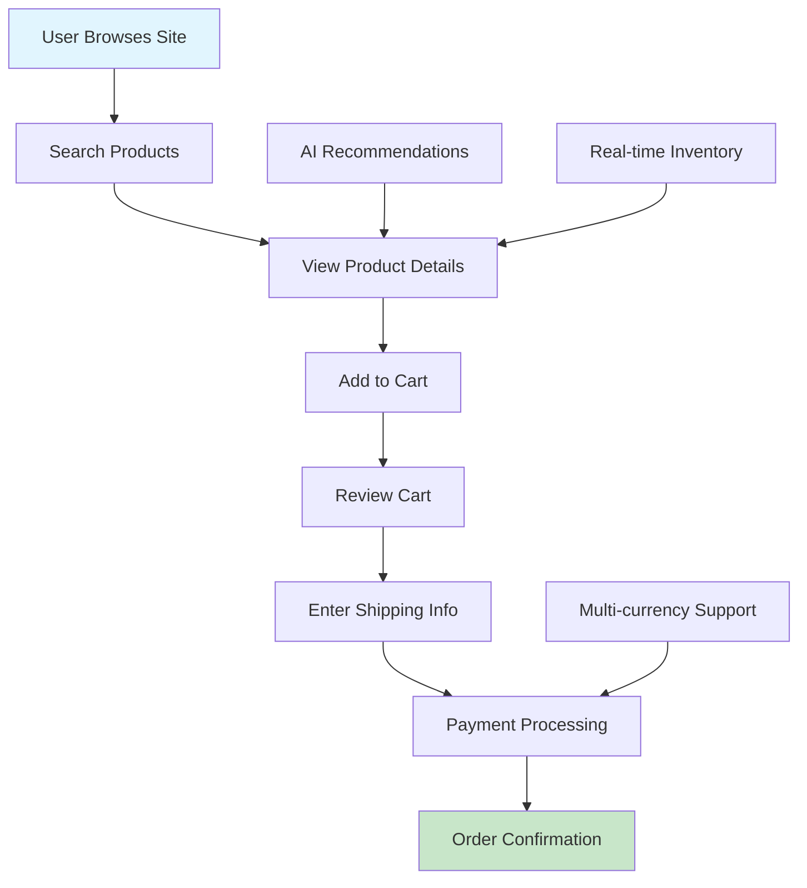
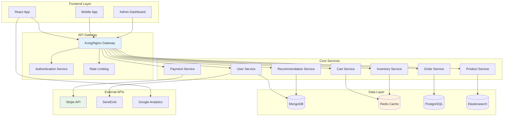
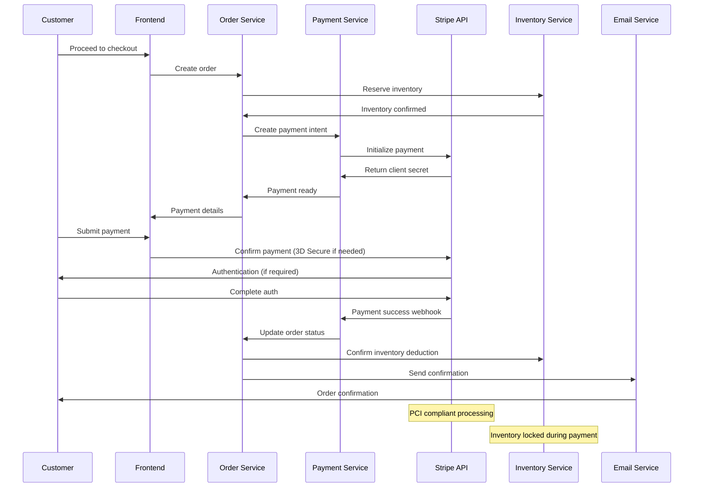

## Overview

Built a full-stack e-commerce solution that handles over 10,000 daily transactions with 99.9% uptime. The platform features a responsive design, advanced search capabilities, and an integrated analytics dashboard.

## User Journey Flow

## Microservices Architecture

## Key Features

### Real-time Inventory Management
Live stock updates across multiple warehouses with automatic reordering when inventory falls below threshold levels. Integrated barcode scanning for quick stock takes.

### Smart Product Recommendations
AI-powered product suggestions based on user behavior, purchase history, and trending items. Increased average order value by 23% through strategic cross-selling.

### Multi-currency Support
Accepts payments in 15+ currencies with real-time exchange rate updates. Stripe integration ensures PCI compliance and secure payment processing.

### Admin Dashboard
Comprehensive analytics and reporting tools including:
- Sales trends and forecasting
- Customer behavior analytics
- Inventory turnover rates
- Revenue breakdowns by category

## Payment Processing Flow

## Technical Implementation

### Backend Architecture
The backend leverages Node.js with Express for handling API requests, while MongoDB provides flexible schema design for product catalogs. Implemented Redis caching to reduce database load by 60%.

### Frontend Development
Frontend built with React and TypeScript ensures type safety and maintainable code. Implemented lazy loading and code splitting to achieve a Lighthouse score of 95+.

### Performance Optimizations
- Image optimization with WebP format and lazy loading
- CDN integration for static assets
- Database indexing for faster queries
- API response caching

## Challenges Overcome

One major challenge was handling concurrent checkout requests during flash sales. Implemented a queue system using Bull and Redis that processes 500+ orders per minute without conflicts or overselling.

Another challenge was ensuring payment security while maintaining a smooth user experience. Integrated 3D Secure authentication without adding friction to the checkout process.

## Results

- 150% increase in conversion rate
- 40% reduction in cart abandonment
- 99.9% uptime over 12 months
- Average page load time: 1.2 seconds

## Future Enhancements

Planning to add:
- Voice search functionality
- AR product previews
- Subscription-based purchasing
- Social commerce integration
