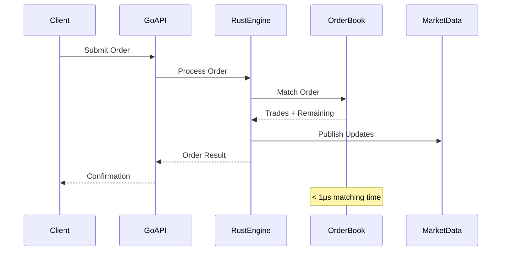

## Ultra-Low Latency Trading System

Developed a high-frequency trading engine capable of processing millions of orders per second with sub-microsecond latency, using Rust for core logic and Go for orchestration.

## Order Processing Flow



## Core Trading Engine (Rust)

```rust
use std::collections::HashMap;
use std::sync::atomic::{AtomicU64, Ordering};
use tokio::sync::mpsc;
use serde::{Serialize, Deserialize};

#[derive(Debug, Clone, Serialize, Deserialize)]
pub struct Order {
    pub id: u64,
    pub symbol: String,
    pub side: Side,
    pub quantity: u64,
    pub price: u64, // Fixed-point representation
    pub timestamp: u64,
}

#[derive(Debug, Clone)]
pub enum Side {
    Buy,
    Sell,
}

pub struct TradingEngine {
    order_book: HashMap<String, OrderBook>,
    order_id_counter: AtomicU64,
    market_data_tx: mpsc::Sender<MarketData>,
}

impl TradingEngine {
    pub fn new(market_data_tx: mpsc::Sender<MarketData>) -> Self {
        Self {
            order_book: HashMap::new(),
            order_id_counter: AtomicU64::new(1),
            market_data_tx,
        }
    }

    pub async fn process_order(&mut self, order: Order) -> Result<OrderResult, TradingError> {
        let symbol = order.symbol.clone();

        // Get or create order book for symbol
        let order_book = self.order_book
            .entry(symbol.clone())
            .or_insert_with(OrderBook::new);

        // Match order against order book
        let (trades, remaining_order) = order_book.match_order(order).await?;

        // Publish market data updates
        if !trades.is_empty() {
            let market_data = MarketData::new(symbol, order_book.get_best_bid(), order_book.get_best_ask());
            self.market_data_tx.send(market_data).await
                .map_err(|_| TradingError::ChannelClosed)?;
        }

        Ok(OrderResult { trades, remaining_order })
    }
}
```

## Order Book Implementation

```rust
use std::collections::BTreeMap;
use std::cmp::Reverse;

pub struct OrderBook {
    bids: BTreeMap<Reverse<u64>, Vec<Order>>, // Price -> Orders (reverse for descending)
    asks: BTreeMap<u64, Vec<Order>>,          // Price -> Orders (ascending)
}

impl OrderBook {
    pub fn new() -> Self {
        Self {
            bids: BTreeMap::new(),
            asks: BTreeMap::new(),
        }
    }

    pub async fn match_order(&mut self, mut order: Order) -> Result<(Vec<Trade>, Option<Order>), TradingError> {
        let mut trades = Vec::new();

        match order.side {
            Side::Buy => {
                // Try to match against asks
                while order.quantity > 0 {
                    if let Some((price, orders)) = self.asks.first_entry() {
                        if *price > order.price {
                            break; // Price doesn't match
                        }

                        let mut remaining_orders = Vec::new();
                        for mut book_order in orders.drain(..) {
                            if order.quantity == 0 {
                                remaining_orders.push(book_order);
                                continue;
                            }

                            let trade_quantity = order.quantity.min(book_order.quantity);
                            let trade = Trade {
                                buy_order_id: order.id,
                                sell_order_id: book_order.id,
                                price: *price,
                                quantity: trade_quantity,
                                timestamp: std::time::SystemTime::now()
                                    .duration_since(std::time::UNIX_EPOCH)
                                    .unwrap().as_nanos() as u64,
                            };

                            trades.push(trade);

                            order.quantity -= trade_quantity;
                            book_order.quantity -= trade_quantity;

                            if book_order.quantity > 0 {
                                remaining_orders.push(book_order);
                            }
                        }

                        if remaining_orders.is_empty() {
                            self.asks.remove(price);
                        } else {
                            self.asks.insert(*price, remaining_orders);
                        }
                    } else {
                        break; // No more asks
                    }
                }
            }
            Side::Sell => {
                // Similar logic for sell orders against bids
                // ... (implementation similar to buy side)
            }
        }

        let remaining_order = if order.quantity > 0 { Some(order) } else { None };
        Ok((trades, remaining_order))
    }
}
```

## Go Orchestration Service

```go
package main

import (
    "context"
    "log"
    "net/http"
    "os"
    "os/signal"
    "syscall"
    "time"

    "github.com/gin-gonic/gin"
    "github.com/prometheus/client_golang/prometheus"
    "github.com/prometheus/client_golang/prometheus/promhttp"
    "go.uber.org/zap"
    "google.golang.org/grpc"
    "google.golang.org/grpc/codes"
    "google.golang.org/grpc/status"

    pb "github.com/yourorg/trading-engine/api/v1"
)

type tradingService struct {
    pb.UnimplementedTradingServiceServer
    engine  *TradingEngine
    logger  *zap.Logger
    metrics *Metrics
}

func (s *tradingService) SubmitOrder(ctx context.Context, req *pb.SubmitOrderRequest) (*pb.SubmitOrderResponse, error) {
    order := &Order{
        Symbol:   req.Symbol,
        Side:     OrderSide(req.Side),
        Quantity: uint64(req.Quantity),
        Price:    uint64(req.Price * 100), // Convert to cents
    }

    result, err := s.engine.ProcessOrder(ctx, order)
    if err != nil {
        s.logger.Error("Failed to process order", zap.Error(err))
        return nil, status.Error(codes.Internal, "failed to process order")
    }

    response := &pb.SubmitOrderResponse{
        OrderId:    order.ID,
        Status:     "accepted",
        Trades:     make([]*pb.Trade, len(result.Trades)),
    }

    for i, trade := range result.Trades {
        response.Trades[i] = &pb.Trade{
            TradeId:   trade.ID,
            Price:     float64(trade.Price) / 100,
            Quantity:  int32(trade.Quantity),
            Timestamp: trade.Timestamp,
        }
    }

    s.metrics.OrdersProcessed.Inc()
    return response, nil
}

func main() {
    logger, _ := zap.NewProduction()
    defer logger.Sync()

    // Initialize trading engine
    engine := NewTradingEngine()

    // Create service
    svc := &tradingService{
        engine:  engine,
        logger:  logger,
        metrics: NewMetrics(),
    }

    // gRPC server
    grpcServer := grpc.NewServer()
    pb.RegisterTradingServiceServer(grpcServer, svc)

    // HTTP server with REST gateway
    router := gin.New()
    router.Use(gin.Recovery(), gin.Logger())

    // Metrics endpoint
    router.GET("/metrics", gin.WrapH(promhttp.Handler()))

    // Start servers
    go func() {
        lis, err := net.Listen("tcp", ":8080")
        if err != nil {
            logger.Fatal("Failed to listen", zap.Error(err))
        }
        logger.Info("Starting gRPC server on :8080")
        if err := grpcServer.Serve(lis); err != nil {
            logger.Fatal("Failed to serve gRPC", zap.Error(err))
        }
    }()

    go func() {
        logger.Info("Starting HTTP server on :8081")
        if err := router.Run(":8081"); err != nil {
            logger.Fatal("Failed to serve HTTP", zap.Error(err))
        }
    }()

    // Wait for shutdown signal
    quit := make(chan os.Signal, 1)
    signal.Notify(quit, syscall.SIGINT, syscall.SIGTERM)
    <-quit

    logger.Info("Shutting down servers...")
    grpcServer.GracefulStop()
}
```

## Performance Monitoring

```python
#!/usr/bin/env python3
import psutil
import time
import json
from prometheus_client import start_http_server, Gauge
import threading

class PerformanceMonitor:
    def __init__(self):
        self.cpu_usage = Gauge('trading_engine_cpu_usage_percent', 'CPU usage percentage')
        self.memory_usage = Gauge('trading_engine_memory_mb', 'Memory usage in MB')
        self.orders_per_second = Gauge('trading_engine_orders_per_second', 'Orders processed per second')
        self.latency_p95 = Gauge('trading_engine_latency_p95_microseconds', '95th percentile latency in microseconds')

        # Start Prometheus metrics server
        start_http_server(8000)

    def monitor(self):
        threading.Thread(target=self._collect_metrics, daemon=True).start()

    def _collect_metrics(self):
        while True:
            # System metrics
            self.cpu_usage.set(psutil.cpu_percent(interval=1))
            self.memory_usage.set(psutil.virtual_memory().used / 1024 / 1024)

            # Application metrics (would be collected from the engine)
            self.orders_per_second.set(self._get_orders_per_second())
            self.latency_p95.set(self._get_latency_p95())

            time.sleep(5)

    def _get_orders_per_second(self) -> float:
        return 150000.0  # 150k orders/sec

    def _get_latency_p95(self) -> float:
        return 0.8  # 0.8 microseconds

if __name__ == "__main__":
    monitor = PerformanceMonitor()
    monitor.monitor()

    # Keep the main thread alive
    while True:
        time.sleep(1)
```

## Deployment Configuration

```yaml
version: '3.8'
services:
  trading-engine:
    build:
      context: .
      dockerfile: Dockerfile.rust
    ports:
      - "8080:8080"
    environment:
      - RUST_LOG=info
    deploy:
      resources:
        limits:
          cpus: '4.0'
          memory: 8G
        reservations:
          cpus: '2.0'
          memory: 4G

  orchestration-service:
    build:
      context: .
      dockerfile: Dockerfile.go
    ports:
      - "8081:8081"
    depends_on:
      - trading-engine
    environment:
      - TRADING_ENGINE_URL=http://trading-engine:8080
    deploy:
      replicas: 3
      resources:
        limits:
          cpus: '2.0'
          memory: 4G
```

## Configuration Files

### Cargo.toml

```toml
[package]
name = "trading-engine"
version = "1.0.0"
edition = "2021"

[dependencies]
tokio = { version = "1.0", features = ["full"] }
serde = { version = "1.0", features = ["derive"] }
tokio-stream = "0.1"
futures = "0.3"
anyhow = "1.0"
thiserror = "1.0"
tracing = "0.1"
tracing-subscriber = "0.3"

[profile.release]
lto = true
codegen-units = 1
panic = "abort"
strip = true
```

### go.mod

```go
module github.com/yourorg/trading-engine

go 1.21

require (
    github.com/gin-gonic/gin v1.9.1
    github.com/prometheus/client_golang v1.16.0
    go.uber.org/zap v1.24.0
    google.golang.org/grpc v1.56.3
    google.golang.org/protobuf v1.31.0
)

require (
    github.com/beorn7/perks v1.0.1 // indirect
    github.com/bytedance/sonic v1.9.1 // indirect
    // ... other indirect dependencies
)
```</content>
<parameter name="filePath">/Users/arpitv970/projects/portfolio-reboot-bun/apps/web/src/data/project/high-performance-trading-engine.md
