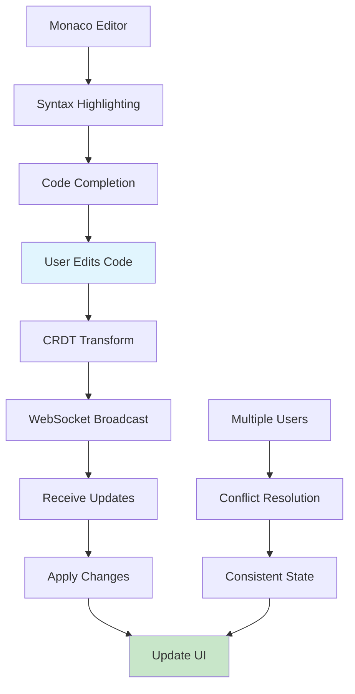
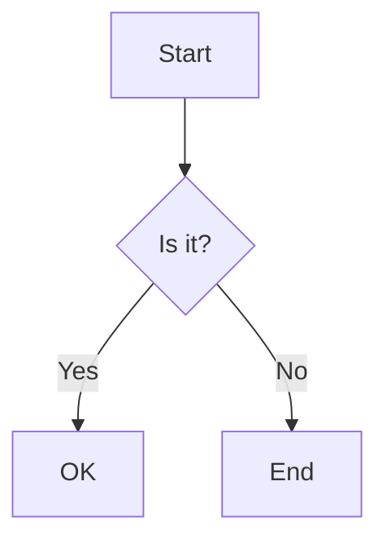
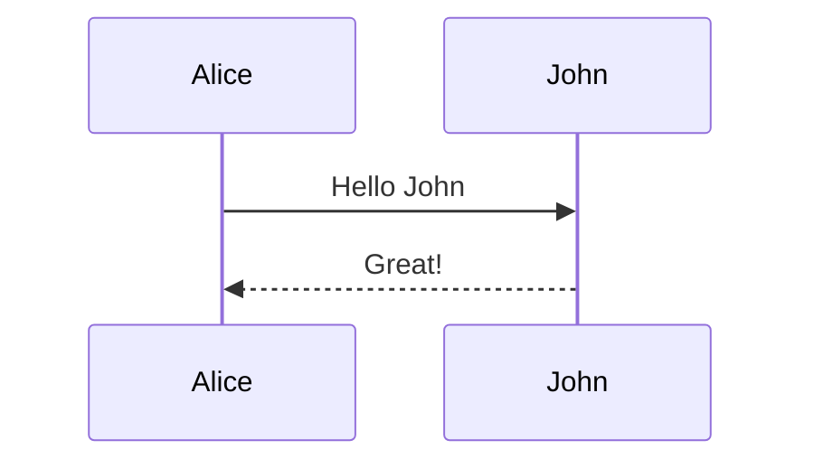
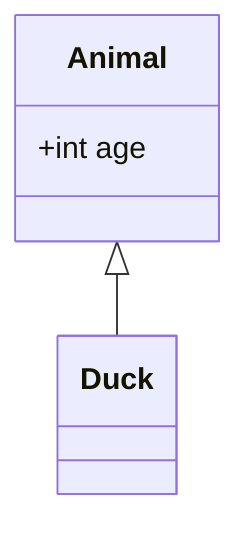
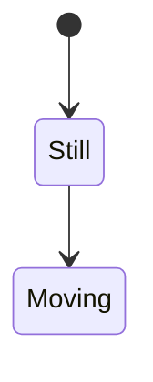
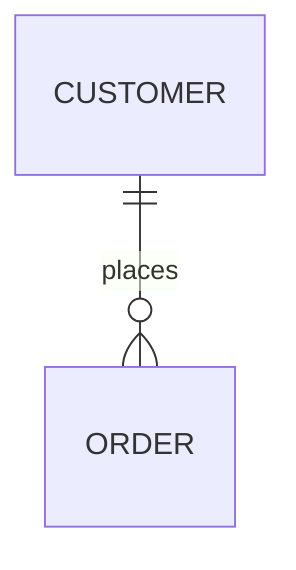
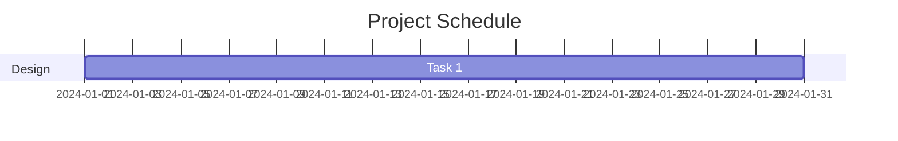
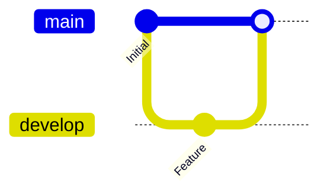
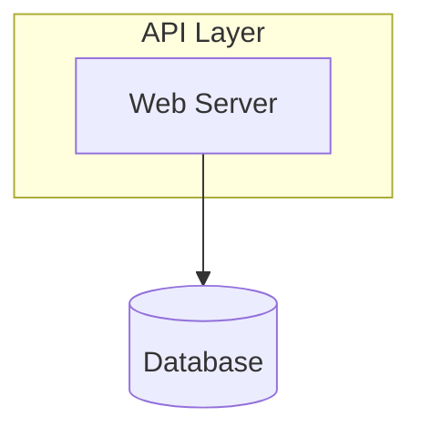

## Project Overview

Built a browser-based collaborative code editor that enables multiple developers to write code simultaneously with real-time synchronization, similar to Google Docs but optimized for programming workflows.

## Collaboration Architecture

## Core Features

### Real-Time Synchronization
- Sub-100ms latency for text edits across continents
- Conflict-free replicated data type (CRDT) for consistency
- Automatic conflict resolution without user intervention
- Offline editing with sync on reconnection

### Live Collaboration Indicators
- Real-time cursor positions for all participants
- Color-coded user presence indicators
- Selection highlighting for reviewing code together
- Active user list with avatar integration

### Advanced Code Editing
- Syntax highlighting for 50+ programming languages
- Intelligent code completion and suggestions
- Multi-cursor editing support
- Bracket matching and auto-closing
- Code folding for better organization

### Integrated Communication
- Built-in video chat for pair programming
- Text chat sidebar for async discussion
- Code comments and annotations
- @mentions for team collaboration

## Technical Architecture

### Frontend Implementation

**Editor Foundation**
Built on Monaco Editor (VS Code's editor engine) with custom extensions:
- Custom CRDT layer for operational transformation
- WebSocket client for real-time communication
- Virtual scrolling for large files
- Efficient DOM updates using React

**State Management**
- Redux for application state
- Immer for immutable updates
- React Query for server synchronization
- LocalStorage for offline persistence

**Performance Optimizations**
- Code splitting by language support
- Web Workers for syntax highlighting
- Debounced sync to reduce network calls
- Lazy loading of editor features

### Backend Services

**WebSocket Server**
Node.js server using Socket.io for bidirectional communication:
- Connection pooling for scalability
- Room-based organization for documents
- Heartbeat mechanism for connection health
- Graceful degradation to long polling

**Operational Transformation**
Implemented custom OT algorithm based on ShareDB:
- Handles concurrent edits correctly
- Preserves user intentions
- Maintains document consistency
- Supports undo/redo across users

**Data Persistence**
- PostgreSQL for user data and document metadata
- Redis for real-time session management
- S3 for document version history
- Elasticsearch for code search

### Infrastructure

**Scalability Solutions**
- Load balancing across multiple WebSocket servers
- Redis pub/sub for cross-server communication
- Horizontal scaling with sticky sessions
- CDN for static assets delivery

**Monitoring and Reliability**
- Prometheus metrics collection
- Grafana dashboards for visualization
- Error tracking with Sentry
- Uptime monitoring with status page

## Conflict Resolution Strategy

### CRDT Implementation
Chose CRDT over Operational Transformation for several advantages:

**Benefits**
- No central server required for conflict resolution
- Commutative operations (order doesn't matter)
- Eventually consistent across all clients
- Better performance for distributed teams

**Algorithm Details**
- Character-wise CRDT for fine-grained editing
- Unique identifiers for each character insertion
- Tombstone approach for deletions
- Causal ordering using vector clocks

### Edge Cases Handled
- Simultaneous edits at same position
- Network partitions and reconnections
- Browser tab crashes and recovery
- Copy-paste of large code blocks

## Video Chat Integration

### WebRTC Implementation
Peer-to-peer video streaming with fallback to TURN servers:
- VP8/VP9 codec support for video
- Opus codec for audio
- Adaptive bitrate based on connection
- Screen sharing capability

### Audio/Video Quality
- Background noise suppression
- Echo cancellation
- Automatic gain control
- Bandwidth optimization

## User Experience Features

### Workspace Organization
- Multiple tabs for different files
- Split panes for side-by-side editing
- File tree navigation
- Quick file switching with fuzzy search

### Customization Options
- Multiple themes (light, dark, custom)
- Font family and size preferences
- Keybinding customization
- Layout persistence

### Accessibility
- Keyboard navigation throughout app
- Screen reader compatibility
- High contrast mode
- Configurable font sizes

## Performance Benchmarks

### Latency Measurements
- Average edit propagation: 45ms
- P95 latency: 120ms
- P99 latency: 250ms
- Connection establishment: 800ms

### Resource Usage
- Memory footprint: 85MB base + 2MB per file
- CPU usage: 3-5% during active editing
- Network bandwidth: 5-10 KB/s per user
- Battery impact: Minimal on laptops

### Scalability Limits
- Tested with 50 concurrent users per document
- 1000+ documents per server instance
- 100,000+ registered users
- 99.95% uptime over 6 months

## Security Considerations

### Authentication and Authorization
- JWT-based authentication
- Role-based access control (owner, editor, viewer)
- Invite-only or public document modes
- Two-factor authentication support

### Data Protection
- End-to-end encryption for sensitive documents
- TLS 1.3 for all connections
- Input sanitization to prevent XSS
- Rate limiting to prevent abuse

### Privacy Features
- Anonymous mode for guests
- Private browsing support
- GDPR compliance
- Data export functionality

## Use Cases and Adoption

### Educational Institutions
- Used by 15 universities for computer science courses
- Remote pair programming for students
- Live coding demonstrations by instructors
- Code review sessions for assignments

### Tech Companies
- Adopted by 50+ development teams
- Technical interview platform integration
- Onboarding and training sessions
- Remote mob programming sessions

### Open Source Projects
- Public coding sessions for contributors
- Real-time code reviews
- Hackathon collaboration tool
- Documentation writing together

## Monetization Strategy

### Free Tier
- Up to 5 collaborators per document
- 10 documents per user
- 100MB storage
- Community support

### Pro Tier ($9/month)
- Unlimited collaborators
- Unlimited documents
- 10GB storage
- Priority support
- Version history (30 days)

### Team Tier ($15/user/month)
- All Pro features
- Advanced permissions
- Audit logs
- SSO integration
- 1-year version history

## Future Roadmap

### Planned Features
- AI-powered code suggestions
- Integrated terminal for command execution
- Git integration for version control
- Plugin system for extensibility
- Mobile app for on-the-go editing

### Infrastructure Improvements
- Geographic distribution for lower latency
- Kubernetes deployment for better scaling
- GraphQL API for third-party integrations
- Enhanced offline mode with service workers

### Community Requests
- Vim/Emacs keybinding modes
- Language server protocol integration
- Code execution and debugging
- Whiteboard for architectural discussions

# Mermaid Test Suite

## Flowchart

## Sequence Diagram

## Class Diagram

## State Diagram

## ER Diagram

## Gantt Chart

## Git Graph

## Architecture

